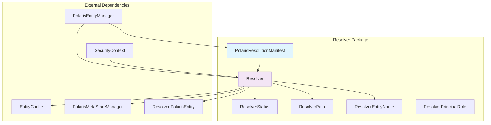
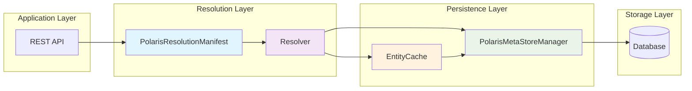
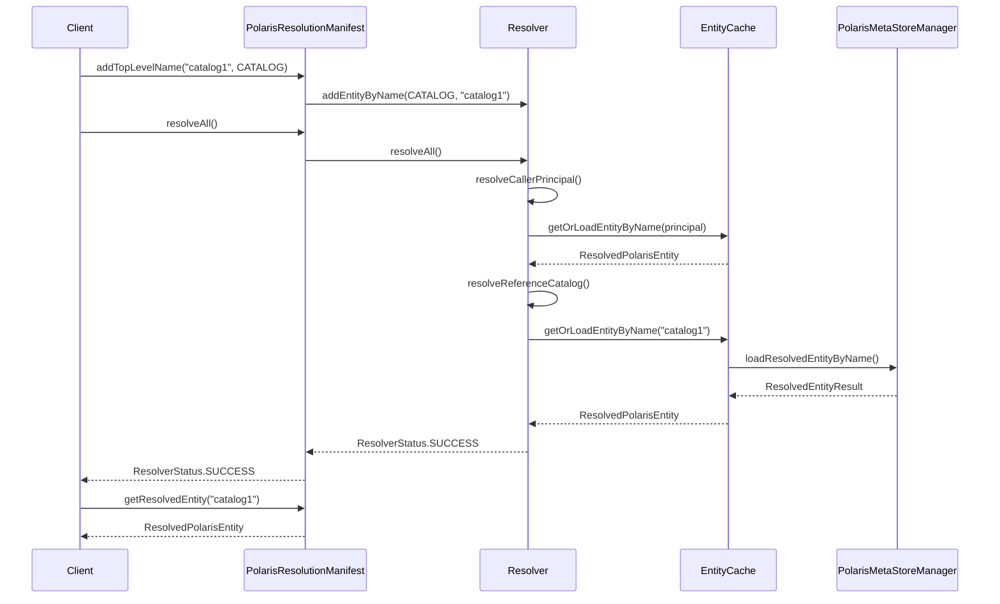
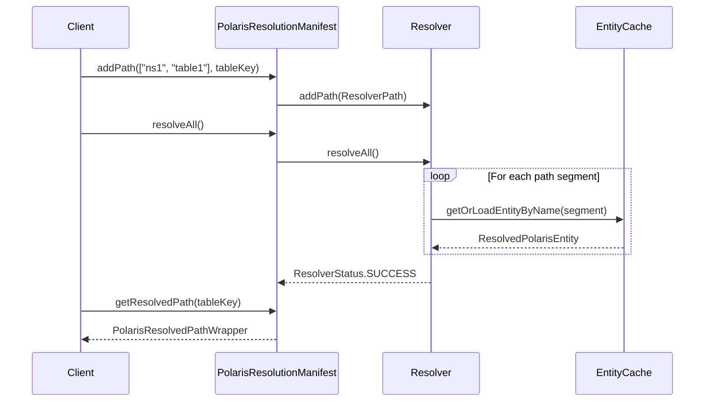
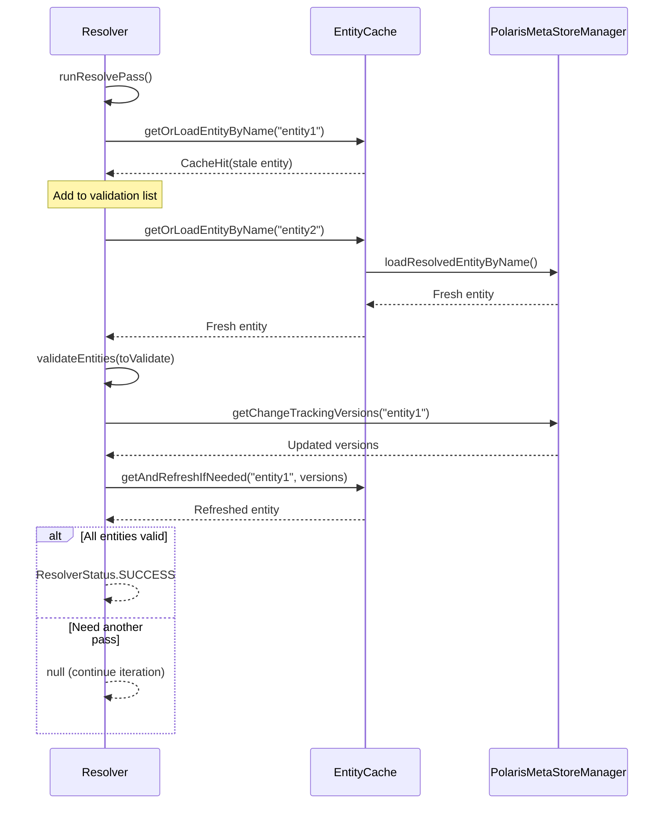
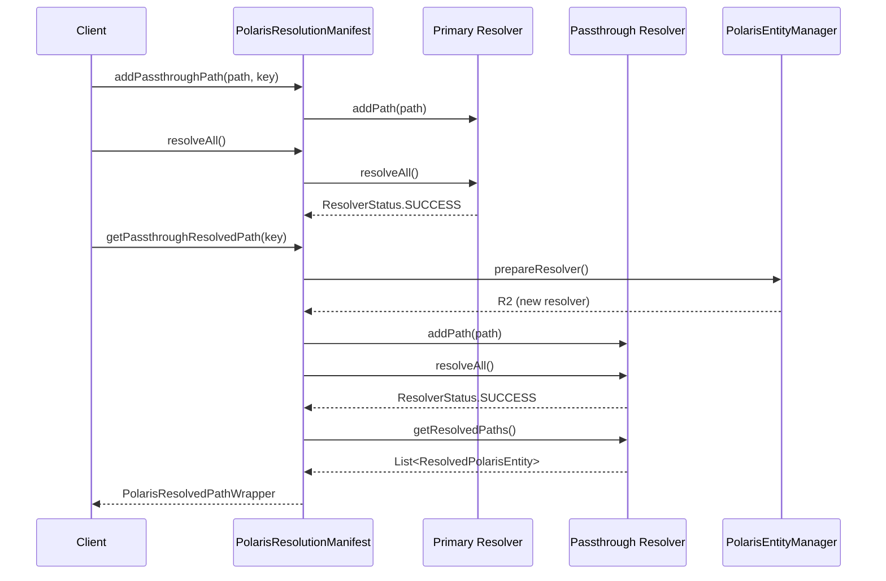
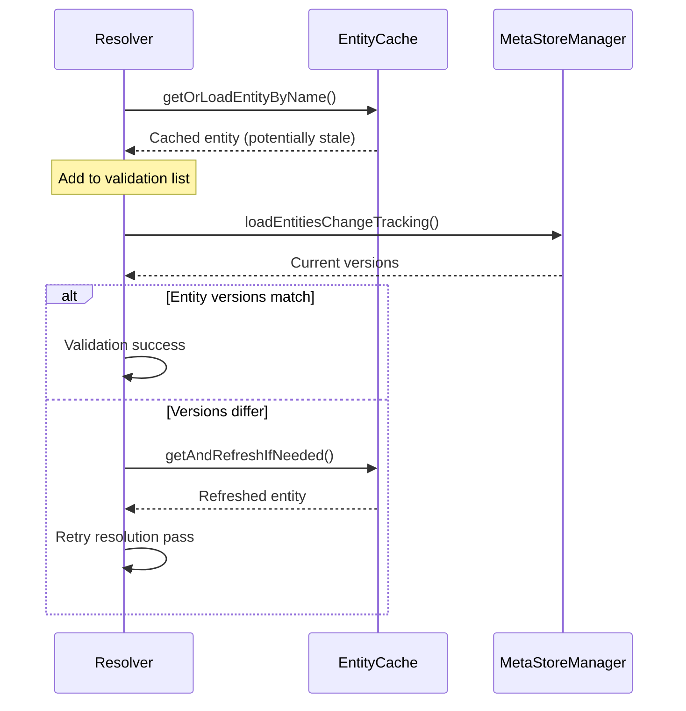

# Polaris Entity Resolution Package

The `org.apache.polaris.core.persistence.resolver` package provides the core entity resolution functionality for Apache Polaris. It handles the complex task of resolving entity references (principals, catalogs, namespaces, tables) from names and paths into fully-resolved entities with their associated permissions and metadata.

## Overview

This package implements a two-tier resolution system:
- **Resolver**: Low-level entity resolution with caching and validation
- **PolarisResolutionManifest**: High-level resolution orchestration and lookup manifest

## Core Components

### Resolver

The `Resolver` class is the core entity resolution engine that:
- Resolves entity names to `ResolvedPolarisEntity` objects
- Handles hierarchical path resolution (catalog → namespace → table)
- Manages entity caching and validation
- Performs multi-pass resolution to handle cache consistency
- Resolves principal roles and catalog roles for authorization

**Key Features:**
- **Multi-pass Resolution**: Handles cache invalidation through iterative validation
- **Hierarchical Path Resolution**: Resolves complex paths like `catalog.namespace.table`
- **Role Resolution**: Automatically resolves principal roles and activated catalog roles
- **Optional Entity Support**: Can mark entities as optional to avoid resolution failures

### PolarisResolutionManifest

The `PolarisResolutionManifest` class provides a higher-level interface that:
- Orchestrates multiple `Resolver` instances
- Provides lookup manifest functionality for resolved entities
- Handles passthrough resolution for dynamic path resolution
- Manages root container simulation for compatibility
- Offers catalog-scoped views of resolved entities

**Key Features:**
- **Static Resolution**: Pre-resolves entities during `resolveAll()`
- **Passthrough Resolution**: Dynamic resolution for additional paths
- **Lookup Manifest**: Fast retrieval of resolved entities by key
- **Catalog Views**: Provides catalog-specific entity resolution views

#### Passthrough Resolution

Passthrough resolution is a dynamic entity resolution mechanism that allows `PolarisResolutionManifest` to resolve additional entity paths on-demand, separate from the static resolution performed during `resolveAll()`.

**How it works:**
1. **Registration**: Paths are registered using `addPassthroughPath()` and are also included in the primary static resolution
2. **Dynamic Resolution**: When `getPassthroughResolvedPath()` is called, a new single-use `Resolver` instance is created
3. **Fresh Resolution**: The new resolver performs a complete resolution of the requested path, bypassing any cached results from the primary resolver
4. **Independent Status**: Passthrough resolution can succeed even if the primary resolution failed for that path

**Use Cases:**
- **Authorization Checks**: Verifying that underlying catalogs can check creation paths for conflicting entities
- **Optional Path Validation**: Resolving paths that may or may not exist without affecting the main resolution status
- **Dynamic Path Discovery**: Resolving paths that are determined at runtime rather than during initial setup
- **Passthrough Facade Support**: For catalogs that act as facades to remote systems, allowing partial path resolution

**Example from CatalogHandler:**
```java
// Add the creation path as optional passthrough to allow conflict checking
resolutionManifest.addPassthroughPath(
    new ResolverPath(
        PolarisCatalogHelpers.tableIdentifierToList(identifier),
        PolarisEntityType.TABLE_LIKE,
        true /* optional */),
    identifier);
```

This mechanism provides flexibility for scenarios where entity resolution needs to happen dynamically based on runtime conditions or where the resolution outcome shouldn't affect the primary authorization flow.

#### Root Container Simulation

The root container (ID=0, name="root_container") serves as the ultimate parent entity for authorization of top-level operations on Catalogs, Principals, and PrincipalRoles. However, in some deployments, the actual root container entity might not exist in the persistence store due to:

- Legacy deployments bootstrapped before root containers were required
- Backend compatibility mismatches between different Polaris versions

When the real root container cannot be resolved, `PolarisResolutionManifest` creates a simulated one in memory with:
- Correct entity structure (ID=0, type=ROOT, name="root")
- Default grants (service_admin role gets SERVICE_MANAGE_ACCESS)
- Proper authorization hierarchy

This ensures authorization chains work correctly even when the underlying persistence layer has compatibility issues with the root container entity.

## Component Relationships



## Architecture Overview



## Inputs and Outputs

### Inputs
- **Entity Names**: Principal names, catalog names, role names
- **Entity Paths**: Hierarchical paths like `catalog.namespace.table`
- **Security Context**: Authentication and authorization context
- **Call Context**: Request context and diagnostics
- **Cache**: Optional entity cache for performance

### Outputs
- **ResolvedPolarisEntity**: Fully resolved entities with metadata and grants
- **ResolverStatus**: Resolution status (success/failure with details)
- **Entity Collections**: Organized collections of resolved entities
- **Authorization Data**: Principal roles, catalog roles, and permissions

## Typical Workflows

### Basic Entity Resolution



### Path Resolution Workflow



### Multi-Pass Resolution with Cache Validation



### Passthrough Resolution



## Error Handling

The resolution system provides detailed error reporting through `ResolverStatus`:

- **SUCCESS**: All entities resolved successfully
- **CALLER_PRINCIPAL_DOES_NOT_EXIST**: Authentication failure
- **PATH_COULD_NOT_BE_FULLY_RESOLVED**: Path resolution failure with specific segment
- **ENTITY_COULD_NOT_BE_RESOLVED**: Named entity resolution failure

## Performance Considerations

1. **Caching**: Leverages `EntityCache` for performance optimization
2. **Multi-pass Resolution**: Minimizes database calls through intelligent validation
3. **Batch Resolution**: Resolves multiple entities in single operations
4. **Optional Entities**: Avoids unnecessary failures for optional components

## Usage Examples

### Basic Entity Resolution
```java
PolarisResolutionManifest manifest = new PolarisResolutionManifest(
    callContext, entityManager, securityContext, "catalog1");

manifest.addTopLevelName("principal1", PolarisEntityType.PRINCIPAL, false);
manifest.addTopLevelName("role1", PolarisEntityType.PRINCIPAL_ROLE, true);

ResolverStatus status = manifest.resolveAll();
if (status.getStatus() == ResolverStatus.StatusEnum.SUCCESS) {
    ResolvedPolarisEntity principal = manifest.getResolvedEntity("principal1");
    // Use resolved entity...
}
```

### Path Resolution
```java
ResolverPath tablePath = new ResolverPath(List.of("namespace1", "table1"));
manifest.addPath(tablePath, tableIdentifier);

ResolverStatus status = manifest.resolveAll();
PolarisResolvedPathWrapper resolvedPath = manifest.getResolvedPath(tableIdentifier);
```

This package forms the foundation of Polaris's security and authorization system by ensuring all entity references are properly resolved and validated before operations proceed.

## Thread Safety and Concurrency

### Concurrency Model

The resolver package is designed with a **per-request isolation** model where each resolution operation uses its own `Resolver` and `PolarisResolutionManifest` instances. This provides thread safety at the request level but requires careful handling of concurrent entity modifications.

### Potential Concurrency Issues

#### 1. Cache Staleness and Entity Consistency

**Problem**: When entities are being resolved and updated simultaneously, cached entities may become stale, leading to:
- Resolved entities with outdated grant records
- Authorization decisions based on revoked permissions
- Inconsistent entity metadata (name, parent relationships)

**Mitigation**: The resolver implements a **multi-pass validation system**:

```java
// From Resolver.java - validates cached entities against backend
boolean validationSuccess = this.bulkValidate(toValidate);
if (validationSuccess) {
    this.updateResolved();
}
return validationSuccess ? status : null; // Retry if validation fails
```

#### 2. Race Conditions in Grant Record Updates

**Problem**: The code contains several TODOs indicating known race condition windows:

```java
// From AtomicOperationMetaStoreManager.java
// TODO: Use post-validation to enforce consistent view against catalogPath. In the
// meantime, happens-before ordering semantics aren't guaranteed during high-concurrency
// race conditions, such as first revoking a grant on a namespace before adding sensitive
// data to a table; but the window of inconsistency is only the duration of a single
// in-flight request
```

**Impact**: During high-concurrency scenarios, there's a window where:
- A grant might be revoked on a namespace
- But a table creation with sensitive data proceeds based on stale cached permissions
- The inconsistency window lasts for the duration of a single request

#### 3. Entity Version Conflicts

**Problem**: Concurrent updates can cause version conflicts when multiple operations try to modify the same entity:

```java
// From TransactionalMetaStoreManagerImpl.java
if (entityRefreshed.getEntityVersion() != entity.getEntityVersion()) {
    return new EntityResult(BaseResult.ReturnStatus.TARGET_ENTITY_CONCURRENTLY_MODIFIED, null);
}
```

**Mitigation**: The system uses optimistic concurrency control with entity versioning and retry mechanisms.

### Current Safeguards

#### 1. Multi-Pass Resolution with Validation

The resolver performs iterative validation to detect and handle stale cached entities:



#### 2. Transactional Validation

For transactional operations, `PolarisEntityResolver` ensures entities haven't changed:

```java
// Validates that resolved entities are still active and unchanged
public boolean validateResolvedEntities(/* ... */) {
    // Check if entities were dropped, renamed, or re-parented
    if (activeEntityRecord == null || activeEntityRecord.getId() != resolveEntity.getId()) {
        return false; // Validation failed, retry needed
    }
}
```

#### 3. Compare-and-Swap Operations

The persistence layer uses entity versions for atomic updates:

```java
// From AbstractTransactionalPersistence.java
if (refreshedEntity.getEntityVersion() != originalEntity.getEntityVersion()) {
    throw new RetryOnConcurrencyException(/* ... */);
}
```

### Remaining Vulnerabilities

#### 1. Cache-Based Resolution Path

When using `EntityCache`, there's an acknowledged window of inconsistency where:
- Cached entities may be stale between validation passes
- Grant record updates may not be immediately visible
- Authorization decisions could be based on outdated permissions

#### 2. Bulk Operations

The current bulk validation approach only validates entities that were cache hits, not all resolved entities:

```java
// TODO: Provide configurable option to enforce bulk validation of *all* entities
// instead of only validating ones on "cache hit"
```

#### 3. Grant Records Version Synchronization

There are potential issues with grant records version going backwards during concurrent updates:

```java
// TODO: Check if this is a bug that might cause grantRecordVersions to go backwards
```

### Recommendations

1. **Enable Strict Validation**: Configure the system to validate all resolved entities, not just cache hits
2. **Shorter Cache TTL**: Use shorter cache expiry times to reduce inconsistency windows
3. **Transactional Resolution**: For critical operations, use transactional meta store managers that provide stronger consistency guarantees
4. **Monitoring**: Implement monitoring for `TARGET_ENTITY_CONCURRENTLY_MODIFIED` errors to detect high contention scenarios

### Conclusion

While the resolver package implements several concurrency safeguards, it operates under an **eventual consistency** model with acknowledged windows of inconsistency during high-concurrency scenarios. The system prioritizes availability and performance over strict consistency, making it suitable for most use cases but requiring careful consideration for security-critical operations where stale grant information could pose risks.
