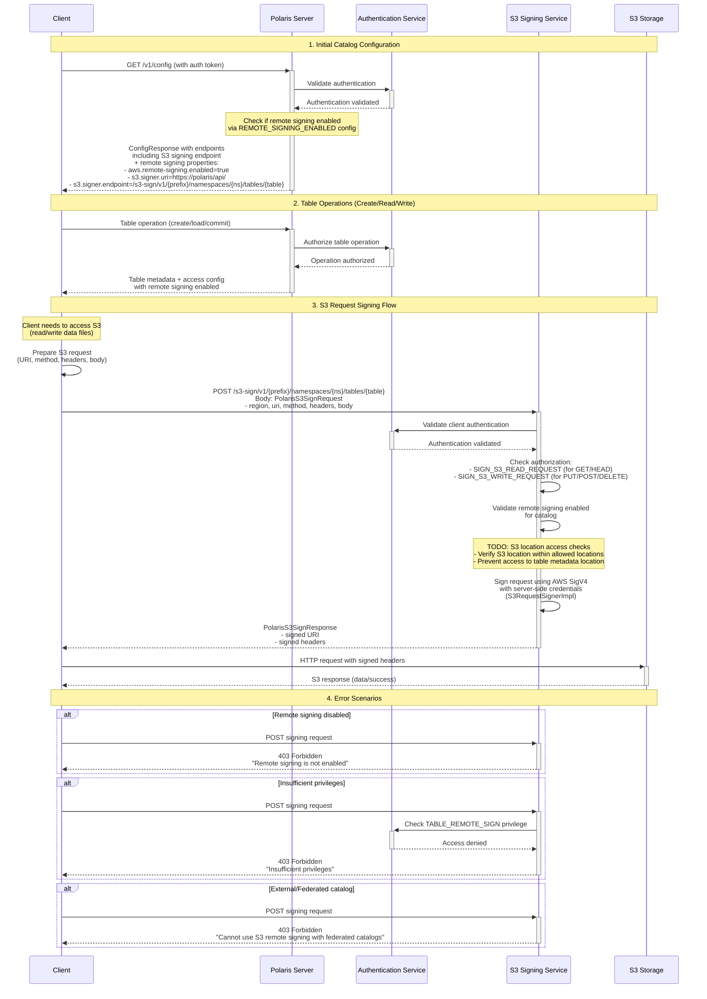

# S3 Remote Request Signing in Apache Polaris

This document explains how remote S3 request signing works in Apache Polaris, including the actors involved and the message exchange patterns.

## Overview

S3 remote request signing allows Polaris to work with S3-compatible object storage systems by providing a centralized signing service. Instead of distributing AWS credentials to clients, clients can request Polaris to sign their S3 requests using server-side credentials.

## Key Components

### Actors

1. **Client** - The application using Apache Iceberg with Polaris catalog
2. **Polaris Server** - The main Polaris catalog service
3. **S3 Storage** - The S3-compatible object storage system
4. **Authentication Service** - Handles client authentication (part of Polaris)

### Key Classes

- `S3RemoteSigningCatalogAdapter` - REST API adapter for signing requests
- `S3RemoteSigningCatalogHandler` - Handles authorization and validation
- `S3RequestSignerImpl` - Performs the actual AWS SigV4 signing
- `AwsCredentialsStorageIntegration` - Provides remote signing configuration

## Configuration

Remote signing must be enabled via:
- System-wide: `REMOTE_SIGNING_ENABLED=true`
- Catalog-level: `polaris.config.remote-signing.enabled=true`

Required privileges:
- `TABLE_REMOTE_SIGN` - Permission to request signing
- `TABLE_READ_DATA` and `TABLE_WRITE_DATA` - For read/write operations

## Sequence Diagram



## Message Details

### 1. Configuration Discovery

**Request**: `GET /v1/config`
- Client discovers available endpoints and capabilities
- Server checks `REMOTE_SIGNING_ENABLED` configuration

**Response**: `ConfigResponse`
```json
{
  "defaults": { /* catalog properties */ },
  "overrides": { "prefix": "catalog-prefix" },
  "endpoints": [
    /* standard endpoints */,
    {
      "method": "POST",
      "path": "/s3-sign/v1/{prefix}/namespaces/{namespace}/tables/{table}"
    }
  ]
}
```

### 2. Access Configuration

When remote signing is enabled, the server provides these properties to clients:
- `aws.remote-signing.enabled=true`
- `s3.signer.uri=https://polaris-server/api/`
- `s3.signer.endpoint=/s3-sign/v1/{prefix}/namespaces/{ns}/tables/{table}`

### 3. Signing Request

**Endpoint**: `POST /s3-sign/v1/{prefix}/namespaces/{namespace}/tables/{table}`

**Request Body**: `PolarisS3SignRequest`
```json
{
  "region": "us-west-2",
  "uri": "https://my-bucket.s3.amazonaws.com/path/to/file",
  "method": "GET",
  "headers": {
    "Host": ["my-bucket.s3.amazonaws.com"],
    "x-amz-content-sha256": ["UNSIGNED-PAYLOAD"]
  },
  "body": null
}
```

**Response**: `PolarisS3SignResponse`
```json
{
  "uri": "https://my-bucket.s3.amazonaws.com/path/to/file",
  "headers": {
    "Host": ["my-bucket.s3.amazonaws.com"],
    "Authorization": ["AWS4-HMAC-SHA256 Credential=..."],
    "x-amz-date": ["20240819T120000Z"],
    "x-amz-content-sha256": ["UNSIGNED-PAYLOAD"]
  }
}
```

## Security Considerations

1. **Authentication**: All requests must be authenticated with valid tokens
2. **Authorization**: Requires `TABLE_REMOTE_SIGN` privilege plus appropriate read/write privileges
3. **Scope Validation**: Future enhancement will validate S3 locations against allowed locations
4. **Credential Isolation**: Server-side AWS credentials are never exposed to clients
5. **External Catalogs**: Remote signing is explicitly disabled for federated/external catalogs

## Current Limitations

- **Experimental Feature**: Remote signing is currently experimental and not enabled by default
- **RBAC**: Role-based access control checks are not production-ready
- **Location Validation**: S3 location access checks are not yet implemented (marked as TODO)
- **Metadata Protection**: Prevention of access to table metadata locations is not yet implemented

## Configuration Properties

| Property | Description | Default |
|----------|-------------|---------|
| `REMOTE_SIGNING_ENABLED` | System-wide remote signing enablement | `false` |
| `polaris.config.remote-signing.enabled` | Catalog-level remote signing enablement | `false` |
| `aws.remote-signing.enabled` | Client property indicating remote signing is available | Set by server |
| `s3.signer.uri` | Base URI for the signing service | Set by server |
| `s3.signer.endpoint` | Specific endpoint path for signing requests | Set by server |
