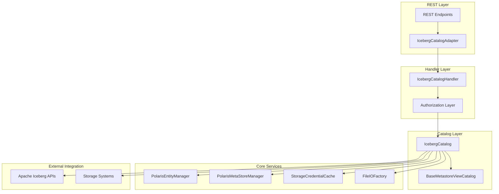
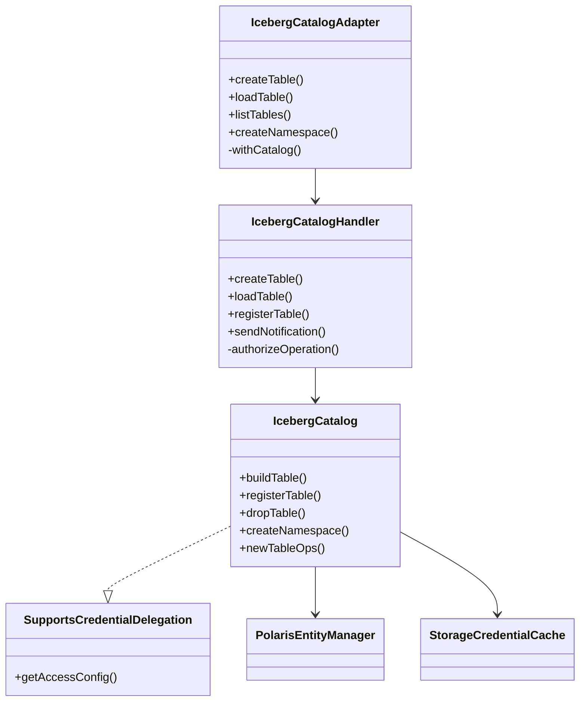
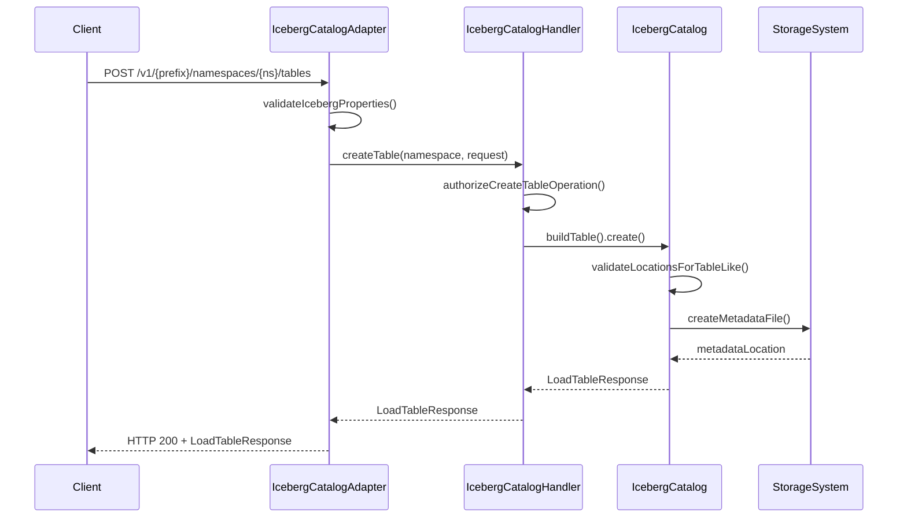
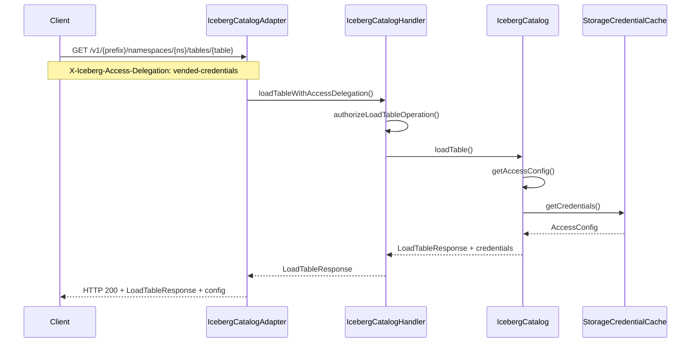
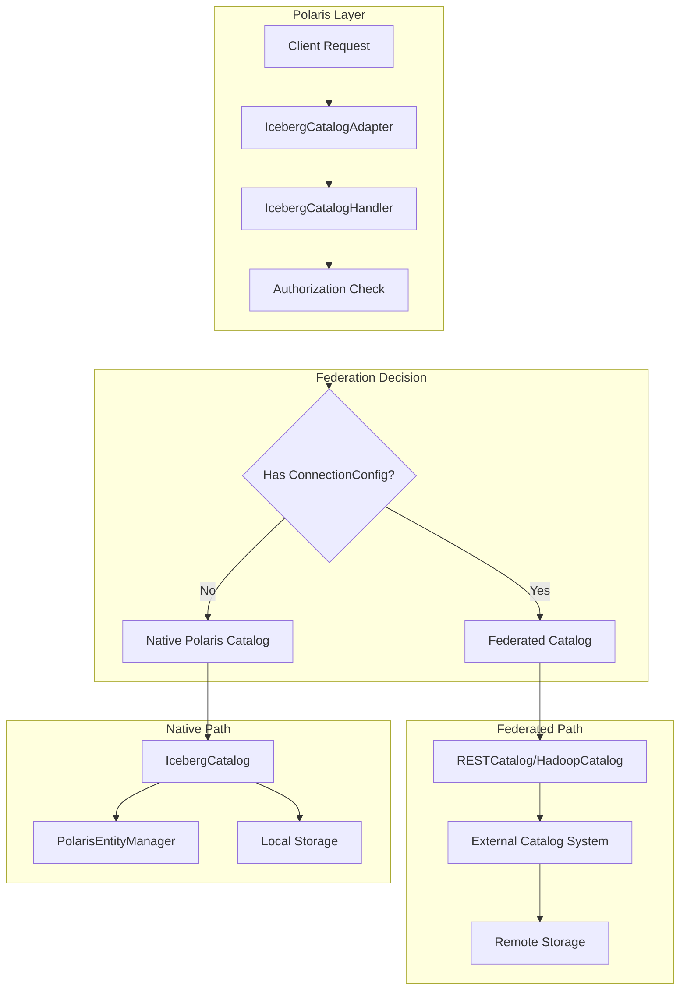
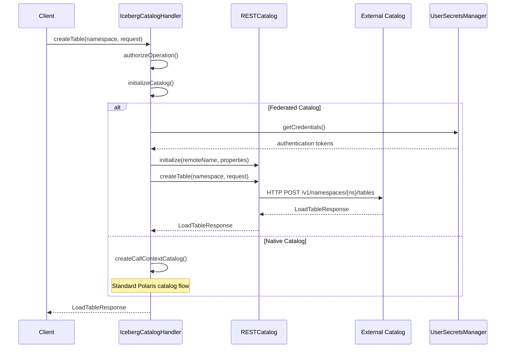

# Apache Polaris Iceberg Catalog Package

The `org.apache.polaris.service.catalog.iceberg` package provides the core implementation for Apache Polaris's Iceberg catalog functionality. This package serves as the bridge between Polaris's entity management system and Apache Iceberg's catalog operations, enabling multi-engine interoperability for Iceberg tables and views.

## Overview

This package implements Polaris's catalog services by extending Apache Iceberg's base catalog classes and integrating them with Polaris's security, storage, and metadata management systems. It provides both internal catalog management and federation capabilities for external Iceberg catalogs.

## Package Components

### Core Classes

- **`IcebergCatalog`** - Main catalog implementation extending `BaseMetastoreViewCatalog`
- **`IcebergCatalogAdapter`** - REST API adapter implementing service interfaces
- **`IcebergCatalogHandler`** - Authorization-aware catalog operations handler
- **`SupportsCredentialDelegation`** - Interface for credential vending capabilities

## Architecture Diagram



## Component Relationships



## IcebergCatalogAdapter

The `IcebergCatalogAdapter` serves as the REST API facade, implementing the Iceberg REST catalog service interfaces. It handles HTTP requests and delegates to the catalog handler.

### Key Responsibilities:
- **Request Validation** - Validates incoming REST requests
- **Response Formatting** - Formats responses according to Iceberg REST API spec
- **Catalog Lifecycle** - Manages catalog handler creation and cleanup
- **Error Handling** - Translates exceptions to appropriate HTTP responses

### Input/Output:
- **Input**: HTTP requests (CreateTableRequest, LoadTableRequest, etc.)
- **Output**: HTTP responses (LoadTableResponse, ListTablesResponse, etc.)

```java
@Override
public Response createTable(
    String prefix,
    String namespace,
    CreateTableRequest createTableRequest,
    String accessDelegationMode,
    RealmContext realmContext,
    SecurityContext securityContext) {
  
  validateIcebergProperties(callContext, createTableRequest.properties());
  EnumSet<AccessDelegationMode> delegationModes = parseAccessDelegationModes(accessDelegationMode);
  Namespace ns = decodeNamespace(namespace);
  
  return withCatalog(securityContext, prefix, catalog -> {
    if (createTableRequest.stageCreate()) {
      return Response.ok(catalog.createTableStaged(ns, createTableRequest)).build();
    } else {
      return Response.ok(catalog.createTable(ns, createTableRequest)).build();
    }
  });
}
```

## IcebergCatalogHandler

The `IcebergCatalogHandler` provides authorization-aware catalog operations, ensuring security policies are enforced before delegating to the underlying catalog.

### Key Responsibilities:
- **Authorization** - Enforces access control policies
- **Entity Resolution** - Resolves catalog paths and validates permissions
- **Credential Vending** - Provides storage credentials when needed
- **Event Handling** - Manages catalog operation events

### Input/Output:
- **Input**: Iceberg model objects (TableIdentifier, CreateTableRequest, etc.)
- **Output**: Iceberg response objects (LoadTableResponse, etc.)

```java
public LoadTableResponse createTable(Namespace namespace, CreateTableRequest request) {
  PolarisAuthorizableOperation op = PolarisAuthorizableOperation.CREATE_TABLE;
  authorizeCreateTableLikeUnderNamespaceOperationOrThrow(
      op, TableIdentifier.of(namespace, request.name()));

  CatalogEntity catalog = CatalogEntity.of(
      resolutionManifest.getResolvedReferenceCatalogEntity()
          .getResolvedLeafEntity().getEntity());
  
  if (isStaticFacade(catalog)) {
    throw new BadRequestException("Cannot create table on static-facade external catalogs.");
  }
  
  return catalogHandlerUtils.createTable(baseCatalog, namespace, request);
}
```

## Typical Workflows

### Table Creation Workflow



### Table Loading with Credential Delegation



## Federated Catalogs

Polaris supports catalog federation, allowing it to proxy requests to external Iceberg catalog implementations while maintaining unified authorization and access control. This enables organizations to integrate existing catalog systems with Polaris.

### How Federation Works

When a catalog is configured with `ConnectionConfigInfo`, the `IcebergCatalogHandler` initializes a federated catalog instead of the native Polaris catalog:

```java
@Override
protected void initializeCatalog() {
  CatalogEntity resolvedCatalogEntity = 
      CatalogEntity.of(resolutionManifest.getResolvedReferenceCatalogEntity().getRawLeafEntity());
  ConnectionConfigInfoDpo connectionConfigInfoDpo = 
      resolvedCatalogEntity.getConnectionConfigInfoDpo();
      
  if (connectionConfigInfoDpo != null) {
    // Initialize federated catalog
    FeatureConfiguration.enforceFeatureEnabledOrThrow(
        callContext, FeatureConfiguration.ENABLE_CATALOG_FEDERATION);
    
    Catalog federatedCatalog;
    ConnectionType connectionType = 
        ConnectionType.fromCode(connectionConfigInfoDpo.getConnectionTypeCode());
        
    switch (connectionType) {
      case ICEBERG_REST:
        federatedCatalog = new RESTCatalog(context, httpClientBuilder);
        break;
      case HADOOP:
        federatedCatalog = new HadoopCatalog();
        break;
    }
    
    this.baseCatalog = federatedCatalog;
  } else {
    // Initialize native Polaris catalog
    this.baseCatalog = catalogFactory.createCallContextCatalog(...);
  }
}
```

### Supported Connection Types

- **`ICEBERG_REST`** - Federates to remote Iceberg REST catalogs
- **`HADOOP`** - Federates to Hadoop-based catalogs

### Authentication Support

Federated catalogs support multiple authentication mechanisms:

- **`OAUTH`** - OAuth 2.0 token-based authentication
- **`BEARER`** - Bearer token authentication

### Federation Architecture



### Federation Workflow



### Configuration Example

Creating a federated catalog through the admin API:

```java
// Create connection configuration for external REST catalog
IcebergRestConnectionConfigInfo connectionConfig = 
    IcebergRestConnectionConfigInfo.builder()
        .setUri("https://external-catalog.example.com/api/v1")
        .setRemoteCatalogName("external_catalog")
        .setAuthenticationParameters(
            AuthenticationParameters.builder()
                .setAuthenticationType(AuthenticationTypeEnum.OAUTH)
                .setClientId("polaris-client")
                .setClientSecret("secret-reference")
                .build())
        .build();

// Create external catalog with federation
Catalog federatedCatalog = ExternalCatalog.builder()
    .setName("federated_catalog")
    .setType(Catalog.TypeEnum.EXTERNAL)
    .setConnectionConfigInfo(connectionConfig)
    .setStorageConfigInfo(storageConfig)
    .build();

adminService.createCatalog(new CreateCatalogRequest(federatedCatalog));
```

### Federation Benefits

- **Unified Access Control** - Polaris authorization applies to federated catalogs
- **Credential Management** - Centralized secret management for external systems
- **Multi-Catalog Support** - Single interface for multiple catalog backends
- **Migration Path** - Gradual migration from external catalogs to Polaris

### Limitations

- **Read-Only Operations** - Some federated catalogs may be read-only
- **Feature Parity** - Not all Polaris features available for federated catalogs
- **Performance** - Additional network hops for federated operations

## Configuration

The package supports various configuration options through Polaris's feature flags:

- `ALLOW_TABLE_LOCATION_OVERLAP` - Controls table location validation
- `ALLOW_EXTERNAL_TABLE_LOCATION` - Permits tables outside namespace hierarchy  
- `ENABLE_CATALOG_FEDERATION` - Enables federated catalog support
- `ALLOW_EXTERNAL_CATALOG_CREDENTIAL_VENDING` - Controls credential delegation for external catalogs

## Integration Points

### With Polaris Core
- **Entity Management** - Uses `PolarisEntityManager` for metadata operations
- **Storage Integration** - Leverages `StorageCredentialCache` for credential management
- **Authorization** - Integrates with Polaris authorization framework

### With Apache Iceberg
- **Catalog Interface** - Implements Iceberg's catalog contracts
- **Table Operations** - Extends Iceberg's `TableOperations` for Polaris-specific behavior
- **View Support** - Provides view catalog capabilities through `BaseMetastoreViewCatalog`

### With External Systems
- **Storage Systems** - Supports S3, Azure, GCS through storage integrations
- **External Catalogs** - Can federate with other Iceberg catalog implementations
- **Query Engines** - Provides REST API compatible with Spark, Trino, Flink, etc.

This package forms the core of Polaris's catalog functionality, enabling secure, multi-engine access to Iceberg tables while maintaining compatibility with the broader Iceberg ecosystem.